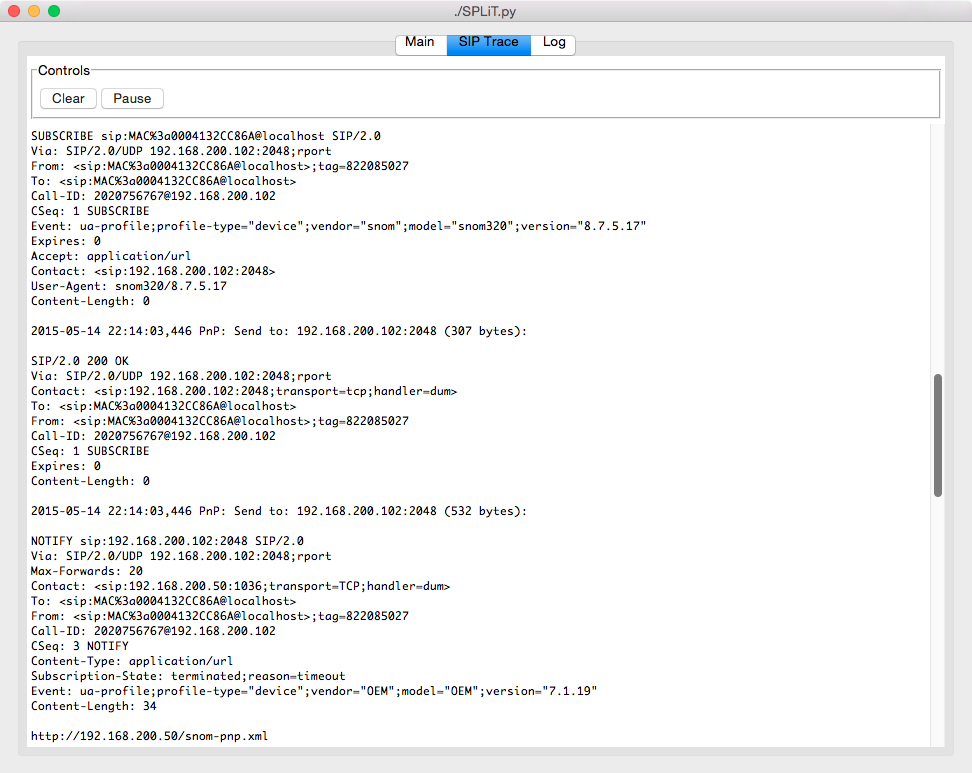
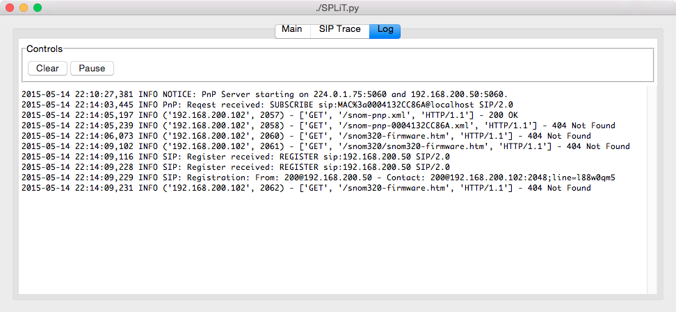

# ssspyxy Simple Stupid SIP Python Proxy

ssspyxy is a **very simple**, **not performat**, **not really well coded**, **full of bugs**, **insecure** and **non fully RFC compliant** SIP proxy.

There is a lot of very good SIP proxy outside here, don't try to use ssspyxy in a production/working environment.

ssspyxy is developed with hackability in mind, the main aim is to reproduce SIP issues, or training / learning purpose.

## Main features

- Registrar with challenge authentication
- Proxy or Redirect server mode
- Proxy of SIP messages between UA
- UDP only suppport
- Self contained and portable: tested on OS-X, Linux, Windows
- TKinter GUI interface

## Installation

- You need the Python 2.7 interpreter already installed, you can find on the Python [website](http://www.python.org)
- Download the [ssspyxy.py](https://raw.githubusercontent.com/pbertera/ssspyxy/master/ssspyxy.py) file and save in your computer
- Run the script from a terminal (or a cmd.exe prompt in Windows)

## Usage

In order to run ssspyxy you need Python installed, (tested on 2.7.8 only at the moment), you can start the server from command line:

    pietro$ python ssspyxy.py -d -i 172.16.18.14 -P protected
    2015-03-06 15:38:00,155 INFO Starting proxy at Fri, 06 Mar 2015 15:38:00 
    2015-03-06 15:38:00,155 DEBUG Using the Record-Route header: Record-Route: <sip:172.16.18.14:5060;lr>
    2015-03-06 15:38:00,155 DEBUG Using the top Via header: Via: SIP/2.0/UDP 172.16.18.14:5060
    2015-03-06 15:38:00,156 DEBUG Writing SIP messages in sip.log log file
    2015-03-06 15:38:00,156 DEBUG Authentication password: protected
    2015-03-06 15:38:00,156 DEBUG Logfile: None
    2015-03-06 15:38:00,157 INFO Starting serving SIP requests on 172.16.18.14:5060, press CTRL-C for exit.

On windows (in a cmd.exe prompt):

    c:\Python27\Python.exe  ssspyxy.py -d -i 172.16.18.14 -P protected
    2015-03-06 15:38:00,155 INFO Starting proxy at Fri, 06 Mar 2015 15:38:00 
    2015-03-06 15:38:00,155 DEBUG Using the Record-Route header: Record-Route: <sip:172.16.18.14:5060;lr>
    2015-03-06 15:38:00,155 DEBUG Using the top Via header: Via: SIP/2.0/UDP 172.16.18.14:5060
    2015-03-06 15:38:00,156 DEBUG Writing SIP messages in sip.log log file
    2015-03-06 15:38:00,156 DEBUG Authentication password: protected
    2015-03-06 15:38:00,156 DEBUG Logfile: None
    2015-03-06 15:38:00,157 INFO Starting serving SIP requests on 172.16.18.14:5060, press CTRL-C for exit.
    
### Command line options

    pietro$ python ssspyxy.py -h
    Usage: ssspyxy.py [OPTIONS]
    
    Options:
        -h, --help      show this help message and exit
        -t              Run in terminal mode (no GUI)
        -d              Run in debug mode
        -r              Act as a redirect server
        -i IP_ADDRESS   Specify ip address to bind on (default: 127.0.0.1)
        -p PORT         Specify the UDP port (default: 5060)
        -s SIP_LOGFILE  Specify the SIP messages log file (default: log to stdout)
        -l LOGFILE      Specify the log file (default: log to stdout)
        -e EXPIRES      Default registration expires (default: 3600)
        -P PASSWORD     Athentication password (default: protected)

# Screenshots

**Main tab:**

**SIP trace:**

**Log messages:**

# Acknowledgment

This work is based on the https://github.com/tirfil/PySipProxy from Philippe THIRION.
